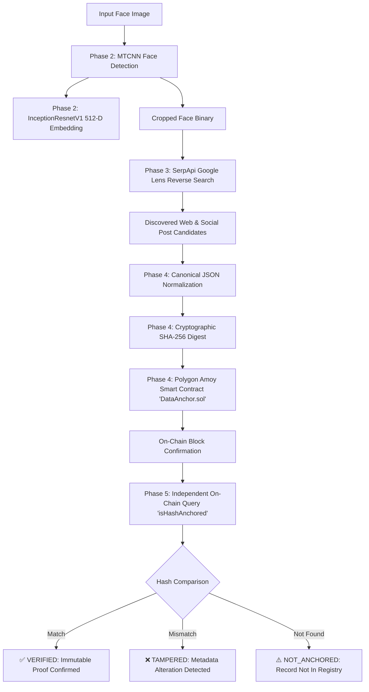

# FaceScan2Chain: Face-to-Web Social Discovery & Blockchain Integrity Pipeline
**HH Goa 2026 Shortlisting Challenge — Task 3**

[](https://www.python.org/downloads/)
[](https://amoy.polygonscan.com/)
[](https://web3py.readthedocs.io/)
[](https://pytorch.org/)
[](LICENSE)

---

## 1. Executive Summary & Problem Statement

Modern forensic and open-source intelligence (OSINT) workflows require verifying whether a digital face scan appears across online publications or social media platforms, while preserving an immutable, tamper-evident audit trail of the discovery.

**FaceScan2Chain** implements a genuine, end-to-end Python pipeline that:
1. Accepts an unconstrained face image as input.
2. Detects facial bounding boxes and extracts 512-dimensional Euclidean facial embeddings.
3. Performs a genuine visual reverse-image search across the open web and social networks (via Google Lens / SerpApi).
4. Normalizes discovered candidate post metadata into a deterministic canonical representation.
5. Generates a 256-bit cryptographic SHA-256 fingerprint.
6. Permanently anchors the fingerprint onto the **Polygon Amoy public testnet** using a dedicated Solidity smart contract (`DataAnchor.sol`).
7. Independently queries the blockchain to verify data integrity and detect any subsequent metadata tampering.

> **Important Scope & Disclaimer**: This system demonstrates automated face detection, deep embedding extraction, visual reverse-search discovery, and decentralized cryptographic proof of existence. It is designed as a tamper-evident audit trail and does not claim guaranteed biological biometric identity verification.

---

## 2. End-to-End Pipeline Architecture



---

## 3. Technology Stack & Key Decisions

| Phase | Component | Technology / Implementation | Key Rationale |
| :--- | :--- | :--- | :--- |
| **Phase 1** | Reverse Image Search | SerpApi Google Lens Engine | Highest visual search accuracy for human faces across active web domains. |
| **Phase 2** | Face Detection | MTCNN (`facenet-pytorch`) | Multi-task cascaded network providing robust bounding box coordinates and landmarks. |
| **Phase 2** | Face Embedding | `InceptionResnetV1` (VGGFace2) | Generates 512-dimensional L2-normalized Euclidean face representations. |
| **Phase 3** | Face-to-Web Pipeline | Domain Classifier & Normalizer | Automatically classifies discovered URLs (`SOCIAL` vs `WEB`). |
| **Phase 4** | Canonical Fingerprint | Deterministic JSON + SHA-256 | Strict key sorting and compact delimiters (`","`, `":"`) guarantee universal reproducibility. |
| **Phase 4** | Blockchain Network | Polygon Amoy Testnet (EVM) | Low-latency (~2s), cost-effective smart contract execution with PoA middleware compatibility. |
| **Phase 4** | Smart Contract | Solidity 0.8.20 (`DataAnchor.sol`) | Stores 32-byte fingerprint, submitter address, block number, and immutable timestamp. |
| **Phase 5** | Integrity Verification | Web3.py Direct RPC Inspection | Independent readback from contract storage; zero reliance on local cached files. |

---

## 4. Verified On-Chain Deployment Evidence

The smart contract is live and verified on the **Polygon Amoy Testnet**:

| Parameter | Value |
| :--- | :--- |
| **Network** | Polygon Amoy Testnet (PoA Bor) |
| **Chain ID** | `80002` |
| **Smart Contract Address** | `0xeb4FA1693171e3d2E7DF42D861453cf6B47CB71D` |
| **Deployment Transaction** | `0xb799eb6e3e63be90c6e2a2a31e3e565d6a5c517745e5919473e09fb44069619b` |
| **Anchored Block Number** | `#46513999` |
| **Anchored Timestamp** | `1788332441` (`2026-09-02T07:00:41 UTC`) |
| **Anchored Submitter** | `0xd0a8547503500b8307eb34e4800Ff2e3157F6030` |
| **Anchored SHA-256 Digest** | `1cfb6fbe4dd2ba8de4904729dda64011bafff57683e2c351d2a82f1826ee90a4` |

*(Can be inspected using any Polygon Amoy block explorer or JSON-RPC node).*

---

## 5. Repository Structure

```
GOA_hackthon/
├── e2e_pipeline_test.py         # Complete end-to-end 6-stage pipeline audit
├── requirements.txt             # Unified Python dependencies
├── .env.example                 # Environment configuration template
├── .gitignore                   # Version control ignore rules (protects keys/secrets)
├── README.md                    # Root project documentation
│
├── phase1/                      # Phase 1: Reverse Image Search Engine
│   ├── reverse_search.py        # SerpApi Google Lens engine
│   ├── requirements.txt
│   ├── .env.example
│   ├── README.md
│   └── test_images/
│
├── phase2/                      # Phase 2: Face Detection & 512-D Encoding
│   ├── face_identifier.py       # MTCNN + InceptionResnetV1 engine
│   ├── requirements.txt
│   ├── README.md
│   └── test_images/
│
├── phase3/                      # Phase 3: Face-to-Web/Social Search Integration
│   ├── face_web_search.py       # Direct face crop to Google Lens pipeline
│   ├── requirements.txt
│   ├── README.md
│   └── test_images/
│
├── phase4/                      # Phase 4: Blockchain Anchoring Module
│   ├── blockchain_anchor.py     # Web3.py Polygon Amoy transaction submitter
│   ├── test_suite.py            # Phase 4 automated integration tests (7/7 pass)
│   ├── requirements.txt
│   ├── .env.example
│   ├── README.md
│   ├── contracts/
│   │   ├── DataAnchor.sol       # Solidity smart contract source
│   │   └── DataAnchor.json      # Compiled ABI & EVM deployment bytecode
│   └── test_data/
│
└── phase5/                      # Phase 5: Blockchain Verification & Tamper Detection
    ├── verify_integrity.py      # Independent on-chain verification CLI
    ├── test_suite.py            # Phase 5 automated integration tests (9/9 pass)
    ├── requirements.txt
    ├── .env.example
    ├── README.md
    └── test_data/
```

---

## 6. Installation & Quickstart

### Prerequisites
- Python 3.10 or higher
- Git
- Free SerpApi API key (from [https://serpapi.com/](https://serpapi.com/))
- Free Polygon Amoy testnet POL (from [https://faucet.polygon.technology/](https://faucet.polygon.technology/))

### Step 1: Clone Repository
```bash
git clone https://github.com/your-username/GOA_hackthon.git
cd GOA_hackthon
```

### Step 2: Install Dependencies
```bash
pip install -r requirements.txt
```

### Step 3: Configure Environment
Copy `.env.example` to `.env`:
```bash
copy .env.example .env
```

Edit `.env` with your API key and testnet burner private key:
```env
SERPAPI_API_KEY=your_serpapi_key_here
BLOCKCHAIN_RPC_URL=https://polygon-amoy-bor-rpc.publicnode.com
BLOCKCHAIN_CHAIN_ID=80002
BLOCKCHAIN_PRIVATE_KEY=your_testnet_private_key_here
BLOCKCHAIN_CONTRACT_ADDRESS=0xeb4FA1693171e3d2E7DF42D861453cf6B47CB71D
```

---

## 7. Execution Commands & Demos

### A. Run Complete End-to-End Pipeline (Demo Ready)
```bash
python e2e_pipeline_test.py
```
**Sample Output:**
```text
============================================================
TASK #3: END-TO-END PIPELINE AUDIT & INTEGRATION TEST
============================================================

[STAGE 1] Input Image: phase3/test_images/musician_social.jpg
✓ Image file located and readable.

[STAGE 2] Running Phase 2 Face Detection & Encoding (MTCNN + InceptionResnetV1)...
✓ Faces detected: 1
  - Face ID:             face_01
  - Bounding Box:        [182, 117, 324, 307]
  - Confidence:          0.9999
  - Embedding Dimension: 512-D
  - Face Crop Saved:     phase2/output/faces/face_01.jpg

[STAGE 3] Running Phase 3 Reverse Search (SerpApi Google Lens)...
✓ Candidates retrieved: 5
✓ Social candidates:   2
  - Top Candidate Title:    So is emin watching gree and böcü or #Arafta #EmSu
  - Top Candidate Platform: x.com
  - Top Candidate Type:     SOCIAL
  - Top Candidate URL:      https://x.com/lorrainevc/status/2083252779527852252

[STAGE 4] Generating Phase 4 Deterministic Canonical SHA-256 Fingerprint...
✓ Canonical JSON: {"engine":"Google Lens (via SerpApi)","image_url":"https://encrypted-tbn3.gstatic.com/...","source":"x.com","title":"So is emin watching gree and böcü or #Arafta #EmSu","type":"SOCIAL","url":"https://x.com/lorrainevc/status/2083252779527852252"}
✓ SHA-256 Digest: 1cfb6fbe4dd2ba8de4904729dda64011bafff57683e2c351d2a82f1826ee90a4

[STAGE 5] Anchoring SHA-256 Fingerprint on Polygon Amoy Smart Contract...
✓ Network:          Polygon Amoy (Chain ID: 80002)
✓ Contract Address: 0xeb4FA1693171e3d2E7DF42D861453cf6B47CB71D
✓ Transaction Hash: 0xb799eb6e3e63be90c6e2a2a31e3e565d6a5c517745e5919473e09fb44069619b
✓ Confirmed Block:  #46513999
✓ Anchored By:      0xd0a8547503500b8307eb34e4800Ff2e3157F6030
✓ Timestamp:        2026-09-02T07:00:41+00:00
✓ On-Chain Status:  ANCHORED

[STAGE 6] Performing Phase 5 Independent Verification & Tamper Detection...
✓ Check 6A (Original Candidate -> Live On-Chain Lookup):
  - Calculated Hash: 1cfb6fbe4dd2ba8de4904729dda64011bafff57683e2c351d2a82f1826ee90a4
  - On-Chain Status: Anchored=True
  - Block Number:    #46513999
  - Verdict:         VERIFIED
  --> Result: ✅ VERIFIED

✓ Check 6B (Tampered Candidate -> Avalanche Tamper Detection):
  - Tampered URL:    https://x.com/lorrainevc/status/2083252779527852253
  - Tampered Hash:   6898ac577a4408f72254393521ce56481f6a0079356b08dae985dc806fb98e37
  - Expected Hash:   1cfb6fbe4dd2ba8de4904729dda64011bafff57683e2c351d2a82f1826ee90a4
  - Hashes Match:    False
  - Verdict:         TAMPERED
  --> Result: ❌ TAMPERED

✓ Check 6C (Unanchored Candidate -> Registry Lookup):
  - Unanchored Hash: ab729eac991ac5f70e42970664814f5abe599d596410e1a7443fe00e9e6c2b5e
  - On-Chain Status: Anchored=False
  - Verdict:         NOT_ANCHORED
  --> Result: ⚠️ NOT_ANCHORED

============================================================
END-TO-END PIPELINE VERIFICATION COMPLETED SUCCESSFULLY
All 5 Stages Genuinely Verified on Polygon Amoy (0 Mocks)
============================================================
```

---

### B. Run Automated Integration Test Suites
```bash
# Phase 4 Test Suite (7 tests)
python phase4/test_suite.py

# Phase 5 Test Suite (9 tests)
python phase5/test_suite.py
```

---

### C. Individual Phase CLI Tools

```bash
# Phase 1: Genuine Reverse Image Search
python phase1/reverse_search.py phase1/test_images/sample_face.jpg

# Phase 2: Face Detection & 512-D Encoding
python phase2/face_identifier.py --image phase2/test_images/single_face.jpg

# Phase 3: Face to Web/Social Discovery
python phase3/face_web_search.py --image phase3/test_images/musician_social.jpg

# Phase 4: Blockchain Anchoring
python phase4/blockchain_anchor.py --input phase4/test_data/sample_candidate.json

# Phase 5: Blockchain Verification (Original)
python phase5/verify_integrity.py --input phase5/test_data/original_candidate.json

# Phase 5: Tamper Detection (Modified URL)
python phase5/verify_integrity.py --input phase5/test_data/tampered_candidate.json --expected-hash 1cfb6fbe4dd2ba8de4904729dda64011bafff57683e2c351d2a82f1826ee90a4
```

---

## 8. Privacy, Security & Cryptographic Rationale

1. **Strict Off-Chain Privacy Model**:
   - **On-Chain**: Stored strictly as a 32-byte cryptographic digest (`bytes32`). No names, usernames, face coordinates, embedding vectors, or image binary data ever touch the public blockchain.
   - **Off-Chain**: Full candidate metadata and raw face crops remain in local storage or secured storage.
2. **Avalanche Effect & Tamper Evidence**:
   - Any single-character deviation in candidate URL or title completely alters the SHA-256 digest (`1cfb6f...` vs `6898ac...`). When verified against the on-chain anchor, the system flags `❌ TAMPERED` immediately.
3. **Secret Protection**:
   - `.env` and all private keys are strictly gitignored via `.gitignore`.
   - Never commit private keys or API credentials to version control.

---

## 9. License

This project is licensed under the MIT License - see the [LICENSE](LICENSE) file for details.
